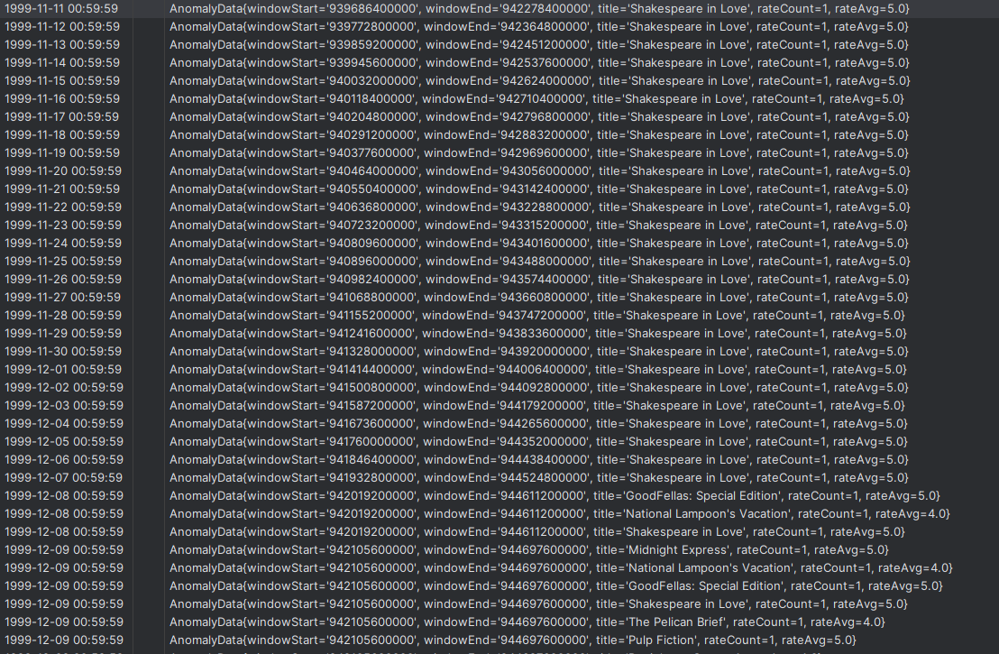
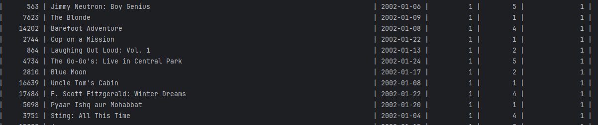

# Netflix Prizes
#### Przetwarzanie strumieni danych Big Data @PUT
#### prowadzone przez dra. Krzysztofa Jankiewicza, PUT
#### Opracowane przez ..., PUT
#### Semestr Letni 2024


## Ustawienia początkowe

Aby uruchomić klaster na Google Cloud użyj:
```shell
gcloud dataproc clusters create ${CLUSTER_NAME} \
--enable-component-gateway --region ${REGION} --subnet default \
--master-machine-type n1-standard-4 --master-boot-disk-size 50 \
--num-workers 2 --worker-machine-type n1-standard-2 --worker-boot-disk-size 50 \
--image-version 2.1-debian11 --optional-components FLINK,DOCKER,ZOOKEEPER \
--project ${PROJECT_ID} --max-age=2h \
--metadata "run-on-master=true" \
--initialization-actions \
gs://goog-dataproc-initialization-actions-${REGION}/kafka/kafka.sh
```

Jest to standardowy klaster, taki sam jak używany na zajęciach. Dołożono do niego dodatkowo interface webowy flinka.

### Producent Kafki
1. Na terminalu nadawczym utwórz potrzebne tematy kafki korzystając ze skryptu `kafka.sh`. Jeżeli nie można, dodaj uprawnienia poleceniem `chmod`.
2. Utwórz folder danych źródłowych `mkdir data` i skopiuj dane z zasobinka na klaster poleceniem `hadoop fs -copyToLocal gs://{bucket}/ścieżka/do/danych`. Upewnij się, że plik `movies.csv` jest w innym folderze niż reszta danych.
3. Utwórz folder `mkdir -p Producer/src/main/resources` i utwórz w nim plik `kafka.properties`, do którego skopiuj zawartość pliku `kafka.properties` dołączonego do rozwiązania. Ustaw parametr `input.dir` na ścieżkę do folderu z danymi (plikami csv).
4. Wgraj plik `producer.jar`

(Całość w pliku `producer-run.sh`)

### Odbiorca - baza danych
1. Utwórz folder na dane wynikowe `mkdir -p /tmp/datadir`
2. Na terminalu odbiorczym uruchom kontener MySQL (hasło `admin`)
```shell
docker run --name mymysql -v /tmp/datadir:/var/lib/mysql -p 6033:3306 \
-e MYSQL_ROOT_PASSWORD=admin -d mysql:debian
```
3. Połącz się z terminalem `docker exec -it mymysql bash` i uruchom polecenie `mysql -uroot -padmin` podając hasło, gdy terminal o to zapyta.
4. Utwórz bazę danych, kopiując trzy pierwsze polecenia z pliku `sink.sql`
```mysql
CREATE USER 'streamuser'@'%' IDENTIFIED BY 'stream';
CREATE DATABASE IF NOT EXISTS etl CHARACTER SET utf8;
GRANT ALL ON etl.* TO 'streamuser'@'%';
```
5. Poleceniem `exit` wyloguj się z konsoli i zaloguj ponownie na konto użytkownika streamuser `mysql -u streamuser -p etl`
6. Utwórz tabelę wynikową za pomocą polecenia `CREATE TABLE` z pliku `sink.sql` i wyloguj się poleceniem `exit`. Zamknij klaster poleceniem `exit`.
   
(Całość w plikach `db-run.sh` i `sink.sql`)

### Odbiorca - kafka
Temat wynikowy kafki został utworzony skryptem `kafka.sh`. 

### Przetwarzanie
1. Pobierz konieczne pliki z repozytorium mavena
```shell
cd ~
wget https://repo1.maven.org/maven2/org/apache/flink/flink-connector-jdbc/1.15.4/flink-connector-jdbc-1.15.4.jar
wget https://repo1.maven.org/maven2/com/mysql/mysql-connector-j/8.0.33/mysql-connector-j-8.0.33.jar
wget https://repo1.maven.org/maven2/org/apache/flink/flink-connector-kafka/1.15.4/flink-connector-kafka-1.15.4.jar
sudo cp ~/*-*.jar /usr/lib/flink/lib/
```
2. Utwórz plik właściwości w lokalizacji `Consumer/src/main/resources/flink.properties` i wgraj do niego zawartość załączonego pliku flink.properties. Upewnij się, że ścieżka do pliku `movie_titles.csv` jest ustawiona poprawnie.
3. Wgraj plik `Consumer.jar`
   
(Całość w pliku `consumer-run.sh`)

## Kod
### 1. Transformacje
Dane dostarczane z tematu kafki są niesformatowanymi stringami. Pierwszym etapem pretwarzania jest wyłuskanie pól z ciągów znaków. Jest to wykonane przez proste mapowanie"
```java
 DataStream<PrizeData> rates = senv.fromSource(consumer, WatermarkStrategy.noWatermarks(), "Rates Source")
                .filter(a -> !a.startsWith("date"))
                .filter(a -> !a.contains("NULL"))
                .map(line -> line.split(","))
                .filter(a -> a.length == 4)
                .map(a -> new PrizeData(
                        a[0],
                        Integer.parseInt(a[1]),
                        Integer.valueOf(a[2]),
                        Integer.valueOf(a[3])
                ));
```
Dwa pierwsze filtry odrzucają wiersze puste i nagłówek. Mapa dzieli po przecinkach, kolejny filtr odrzuca dane niepełne i w końcu są one rzutowane na strukturę klasy.
Podobna operacja wykonywana jest przy odczycie danych o tytułach filmów (z pliku, a nie z kafki). 

Kolejne polecenie służy do połączenia dwóch wyżej wymienionych strumieni danych (dynamicznego i statycznego). Funkcja Combiner służy do połączenia dwóch strumieni i jest w znacznej mierze autogenerowana. Na końcu dodawane są również timestampy (obliczane na podstawie daty wpisanej w dane) i watermarki.
```java
DataStream<CombinedData> scores = movies.connect(rates)
                .keyBy(MovieData::getId, PrizeData::getMovieId)
                .flatMap(new Combiner())
                .assignTimestampsAndWatermarks(new DelayWatermarkGenerator());
```
Ostatecznym etapem przetwarzania danych czasu rzeczywistego jest ich agregacja po identyfikatorze filmu. Przetwarzanie przebiega następująco:
```java
DataStream<EtlAgg> aggregated = scores.keyBy(CombinedData::getMovieId)
                .window(new MonthlyWindowAssigner(properties.get("delay")))
                .aggregate(new AggregatorETL());

        // aggregated.addSink(getMySQLSink(properties));
        aggregated.print();
```
`MonthlyWindowAssigner` jest klasą, która na podstawie daty ustawia okno przetwarzania na okres jednego miesiąca faktycznego (tj. od 1 do ostatniego dnia danego miesiąca kalendarzowego, z uwzględnieniem lat przestępnych).
Zmienna `delay` definiuje tryb wyzwalacza (więcej o tym w następnej sekcji).
Agregator jest klasą, która zbiera dane według klucza i przypisuje je do struktury wynikowej. Istotne są w niej dwie funkcje: 
`add`, która dodaje nowy element do zbioru wynikowego i `getResult`, która konwertuje dane ze struktury tymczasowej na ostateczną.
Struktury różnią się tylko zawartością i typem ostatniego pola, które w przypadku struktury tymczasowej jest listą indeksów użytkowników oceniających, a w przypadku ostatecznej, liczbą określającą ilość unikatowych użytkowników.
Aby uzyskać ilość unikatowych użytkowników, zastosowano następujące polecenie:
```java
 e.setReviewerCount((long) new HashSet<>(tempEtl.getReviewers()).size());
```
Ostatecznie wynik jest wyprowadzany na konsolę (w fazie testów) albo do bazy MySQL.

### 2. Obsługa wyzwalaczy
Aplikacja umożliwia wybranie dwóch typów wyzwalaczy: 
* Wyzwalacz powtarzalnej aktualizacji, oznaczony literą A
* Wyzwalacz kompletności, oznaczony literą C

Zmienna ta podawana jest jako parametr wywołania głównego pliku z flagą `--delay`.
Ich obsługa jest zapewniona w budowie generatora okien:
```java
 @Override
    public Trigger<Object, TimeWindow> getDefaultTrigger(StreamExecutionEnvironment env) {
        return delay.equals("A") ? EveryTrigger.create() : EventTimeTrigger.create();
    }
```
Domyślny `EventTimeTrigger` generuje okna dopiero po minięciu czasu, który obejmują, natomiast samodzielnie deklarowany `EveryTrigger` skutkuje wypluciem wyniku po przyjściu każdego zdarzenia.
### 3. Wykrywanie Anomalii
Kod wykrywający anomalie jest zasadniczo zbliżony do tego przetwarzającego zdarzenia czasu rzeczywistego. 
```java
 DataStream<AnomalyData> anomalies = scores.keyBy(CombinedData::getTitle)
                .window(SlidingEventTimeWindows.of(Time.days(D), Time.days(1)))
                .aggregate(new AggregatorAnomaly(), new ProcessWindowFunction<AnomalyData, AnomalyData, String, TimeWindow>() {
                    @Override
                    public void process(String key, Context context, Iterable<AnomalyData> elements, Collector<AnomalyData> out) {
                        AnomalyData result = elements.iterator().next(); // assuming there is always one element
                        result.setWindowStart(String.valueOf(context.window().getStart()));
                        result.setWindowEnd(String.valueOf(context.window().getEnd()));
                        out.collect(result);
                    }
                })
                .filter(a -> a.getRateAvg() >= O).filter(a -> a.getRateCount() >= L);
```
Początkowo nadawane są klucze agregacji i okna. W tym przypadku okno jest przesuwne, z krokiem długości jednego dnia i rozmiarem równym parametrowi `--D`. 
W kolejnym kroku wykonywana jest agregacja, która przebiega podobnie jak w przypadku ETL. Agregator ma taką samą strukturę. Różnica polega na tym, że funkcja `add` sumuje oceny oraz je zlicza, natomiast funkcja `getResults` oblicza średnią ocen.
Dodatkowa funkcja `process` jest użyta, by wyciągnąć z kontekstu przetwarzania informacje o oknie, mianowicie znacznik czasowy jego początku i końca. Te informacje są dopisywane do struktury wynikowej.
Ostatnim etapem przetwarzania jest nałożenie dwóch filtrów, które pozwolą odsortować elementy niespełniające warunków granicznych definiowanych przez parametry wywołania `--L` i `--O`.
Wynik przetwarzania jest zrzucany do tematu kafki w przy użyciu funkcji `toString`.

## Uruchomienie
Zasadniczo do pełnej obsługi programu potrzebne są cztery terminale:
* Dla producenta
* Dla programu przetwarzającego
* Dla odbiorcy kafki
* Do wglądu w bazę danych z wynikami

Pliki .jar znajdują się w folderze `out`.

Aby uruchomić producenta kafki, należy użyć następującego polecenia:
```shell
export HADOOP_CONF_DIR=/etc/hadoop/conf
export HADOOP_CLASSPATH=`hadoop classpath`
flink run -m yarn-cluster -p 4 \
 -yjm 1024m -ytm 1024m -c \
 TestProducer ~/Producer.jar
```
Uwaga: Błąd
```
Exception in thread "main" java.lang.NullPointerException
	at java.base/java.util.Arrays.stream(Arrays.java:5614)
	at TestProducer.main(TestProducer.java:21)
```
oznacza źle zdefiniowaną ścieżkę do plików danych w `kafka.properties`.

Aby uruchomić program przetwarzający, należy użyć następującego polecenia:
```shell
export HADOOP_CONF_DIR=/etc/hadoop/conf
export HADOOP_CLASSPATH=`hadoop classpath`
flink run -m yarn-cluster -p 4 \
 -yjm 1024m -ytm 1024m -c \
 consumer.NetflixAnalyzer ~/Consumer.jar \
 --D 30 --L 1 --O 4 \
 --delay C
```
ustawiając parametry wywołania na takie, jakie chcemy. Parametry to:
* D - Szerokość okna analizy anomalii (w dniach)
* L - Ilość wymaganych obserwacji
* O - Minimalną średnią ocen
* delay - tryb wyzwalacza: A = wyzwalacz natychmiastowy, C = wyzwalacz kompletności

Gdyby program nie był w stanie znaleźć ścieżki pliku z danymi (movie_titles.csv), to należy podać ścieżkę bezwzględną z zasobnika (tj. gs://{bucket}/ścieżka/do/pliku)
Plik `Consumer_print.jar` zawiera testową wersję programu, tj. taką, która w teorii nie łączy się z bazą, tylko produkuje dane na konsolę. 

## Wyniki
Anomalie są zbierane przez temat kafki. Aby je odebrać, na terminalu odbiorczym uruchom polecenie:
```shell
/usr/lib/kafka/bin/kafka-console-consumer.sh \
 --bootstrap-server {CLUSTER_NAME}-w-0:9092 \
 --topic OutputAnomalies
```
(Plik `kafka-receiver.sh`)

Nazwę klastra najlepiej wpisać ręczenie.
Przykładowe wyniki prezentują się następująco


Wyniki przetwarzania czasu rzeczywistego zbierane są w bazie danych MySQL.
Aby je otworzyć, zaloguj się do konsoli MySQL `mysql -u streamuser -p streamdb` i uruchom polecenie select z pliku `sink.sql`
```mysql
select * from netflix_sink;
```
Gdyby pojawiło się ostrzeżenie o niewybranej bazie danych, użyj polecenia `use etl;`.
Uzyskane wyniki prezentują się następująco:


### Uzasadnienie wyboru miejsca utrzymania danych wynikowych
Zdecydowałem się na użycie bazy MySQL jako miejsca przechowywania wyników przetwarzania czasu rzeczywistego z kilku powodów.
* Wydajność: MySQL jest optymalizowany pod kątem szybkich operacji odczytu i zapisu, co jest kluczowe dla przetwarzania danych w czasie rzeczywistym.
* Skalowalność: Może obsługiwać duże ilości danych i ruch sieciowy, co jest ważne przy pracy ze strumieniami danych.
* Niezawodność: Jest to sprawdzona technologia z dobrą reputacją pod względem stabilności i bezpieczeństwa.
* Wsparcie społeczności: Posiada dużą społeczność użytkowników i programistów, co oznacza, że istnieje wiele zasobów i źródeł wsparcia dostępnych dla użytkowników.
* Integrowalość: Apache Flink dostarcza łatwych w obsłudze connectorów, umożliwiających połączenie z bazą.

Po uruchomieniu na chmurze google okazuje się, że connectory jednak nie są kompatybilne z systemem, co nie pozwala programowi się uruchomić. 

## Uwagi końcowe
Proces przetwarzania niekoniecznie jest optymalny

Gdyby na temacie kafki z anomaliami nie pojawiały się dane, spróbuj ustawić parametry wywołania programu na `* (cokolwiek), 1, 4`. Jeżeli nadal nie ma wyników, znaczy, że nie działa i błąd jest po mojej stronie.

Testowane lokalnie na dockerze i w chmurze google. Aby przetestować kod na dockerze (gdyby kod na cloudzie nie działa), zbuduj obraz dockerowy za pomocą `docker-compose.yml`, skompiluj kod i uruchom go lokalnie. Skrypt tworzący tematy kafki w wersji pod dockera znajduje się w pliku `kafka-docker.sh`